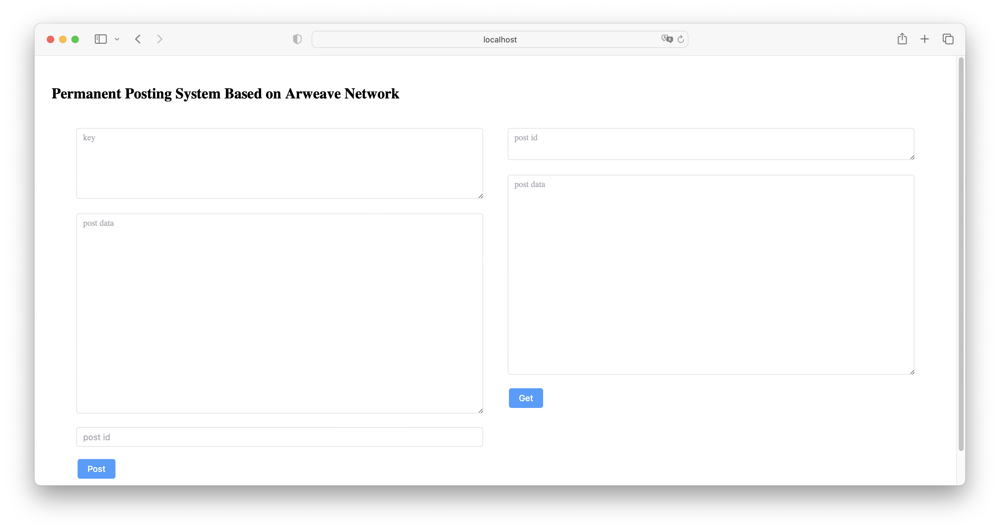

## Blockchain Storage System on Arweave Network


This is a blockchain storage system that allows users to post content to the Arweave Network for permanent storage.

This project was developed for the 2022 HackKing's annual hackathon at King's College London.

Built on: November 19, 2022, at Bush House (S), London.

### Notice:

- Your content will be posted to the Arweave blockchain network; this tool does not store your content locally. Instead, it posts your content to the blockchain for permanent storage.

- You will need the key from an Arweave wallet (including all content from the wallet's `.json` file) with an `AR token` balance to pay the blockchain transaction fee for each posting action.

## Build

- Ensure that you have npm installed on your computer.

## Use

1. Download the ZIP file from this webpage and unzip it into a folder.

2. Open Terminal and navigate to the folder:
  
  ```
  cd path/of/the/folder
  ```

3. In your terminal, enter the following commands line by line:
  
  ```
  npm install
  npm run dev
  ```

4. Open the localhost URL displayed in the terminal in your web browser.

## Created In Collaboration With

Hongyi Tu, Juntong Deng, Qilan Lin.